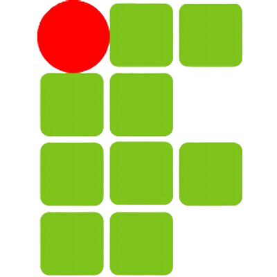

<h1 align="center">
    Oi, eu sou o Arthur! 
  
</h1>

  

<h1> Sobre mim: </h1> 

- Me chamo Arthur Sandrini.
- 📍 Sou de Cachoeiro de Itapemirim, ES.
-   Estudante do IFES, cursando Sistemas de Informação.
- 📈 Disposto ao aprendizado e focado no desenvolvimento.

## Tecnologias Utilizadas:

    &nbsp;
    &nbsp;
    &nbsp;
    &nbsp;
    &nbsp;
    &nbsp;
    &nbsp;

## Estatísticas do GitHub 📊

## Linguagens mais utilizadas 🦾

## Contato em:

 <a href="https://www.linkedin.com/in/arthur-sandrini-4a6474302/" title="LinkedIn">
  
     
   arthsandrini@gmail.com 

</a>

  
